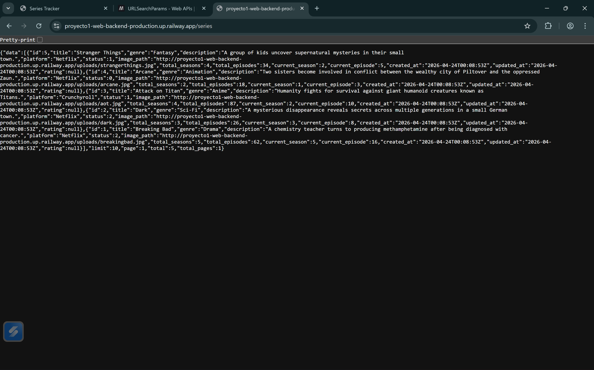

# 📺 Series Tracker API

Backend en Go para una aplicación de seguimiento de series. Permite gestionar series, ratings y archivos de imagen asociados.


## 🔗 Repositorios

- **Backend:** https://github.com/jdivass/Proyecto1-Web-Backend.git
- **FrontEnd:** https://github.com/jdivass/Proyecto1-Web_Frontend.git

---

## 🚀 Tecnologías usadas

- Go (net/http)
- SQLite (modernc.org/sqlite)
- API REST
- JSON
- Manejo manual de uploads
- CORS middleware

---

## 📁 Estructura del proyecto

```
backend/
├── cmd/
│   └── server/
│       └── main.go
├── internal/
│   ├── database/
│   ├── handlers/
│   │   ├── series/
│   │   └── ratings/
│   ├── middleware/
│   ├── models/
│   ├── routes/
│   └── utils/
├── uploads/
```

---

## ⚙️ Instalación y ejecución

### 1. Clonar repositorio

```bash
git clone https://github.com/jdivass/Proyecto1-Web-Backend.git
cd Proyecto1-Web-Backend
```

### 2. Ejecutar el servidor

```bash
go run cmd/server/main.go
```

El servidor corre en:

```
http://localhost:8080
```

---

## 🗄️ Base de datos

Se usa SQLite y se inicializa automáticamente al iniciar el proyecto.

### Tabla: series

- id
- title
- genre
- description
- platform
- status (0,1,2)
- total_seasons
- total_episodes
- current_season
- current_episode
- image_path
- created_at
- updated_at

### Tabla: ratings

- id
- series_id (único, 1 rating por serie)
- content
- stars_quantity (1 a 5)
- created_at

---

## 📌 Endpoints

### 🎬 SERIES

- **GET /series** → Obtener todas las series  
- **GET /series/{id}** → Obtener una serie con su rating  
- **POST /series** → Crear serie (multipart/form-data con imagen)  
- **PUT /series/{id}** → Actualizar serie  
- **DELETE /series/{id}** → Eliminar serie  

---

### ⭐ RATINGS

- **POST /series/{id}/rating** → Crear rating  
- **PUT /series/{id}/rating** → Crear o actualizar rating (upsert)  
- **DELETE /series/{id}/rating** → Eliminar rating  

---

## 🖼️ IMÁGENES

Las imágenes se almacenan en:

```
/uploads
```

Y se acceden mediante:

```
http://localhost:8080/uploads/nombre.jpg
```

###
```
https://proyecto1-web-backend-production.up.railway.app/uploads/nombre.jpg
```

---

## 🌐 DEPLOY

Backend desplegado en:

https://proyecto1-web-backend-production.up.railway.app

---

## 🔐 APLICACIÓN FUNCIONANDO




## 🎯CHALLENGES IMPLEMENTADOS

### Criterios subjetivos
| Challenges Implementados | Puntos |
| -------- | -------- |
| Calidad del historial de Git | 0 - 20 |
| Organizacion del código | 0 - 20 |

### API y Backend
| Challenges Implementados | Puntos |
| -------- | -------- |
| Códigos HTTP correctos en toda la API (201 al crear, 204 al eliminar, 404 si no existe, 400 en input inválido, etc.) | 20 |
| Códigos HTTP correctos en toda la API (201 al crear, 204 al eliminar, 404 si no existe, 400 en input inválido, etc.)| 20 | 
| Paginación en GET /series con parámetros ?page= y ?limit= | 30 |
| Búsqueda por nombre con ?q= | 15 |
| Búsqueda por nombre con ?q= | 15 | 
| Sistema de rating — tabla propia en la base de datos, endpoints REST propios (POST /series/:id/rating, GET /series/:id/rating, etc.), y visible en el cliente. | 30 |
|Sistema de rating — tabla propia en la base de datos, endpoints REST propios (POST /series/:id/rating, GET /series/:id/rating, etc.), y visible en el cliente. | 30 |
| Total | 160 |

## 💡 Reflexión

Hice uso de Go para el desarrollo del backend con librerias como net/http. database/sql modernc.org/sqlite y demás, me parece que el uso de estas librerías para el backend y una buena planificación y organización del desarrollo de este aportaron enormemente a una implementación más sencilla, a pesar de que tomó más tiempo del pensado, evidentemente por la falta de frameworks.

Respecto a los challenges, considero que su implementación si bien resultó laboriosa en términos de investigación y aplicación, no los clasificaría como difíciles debido a que muchas de estas implementaciones se realizaban con cálculos sencillos hacia parametros y queries en la base de datos, pero si  enriquecedores ya que son aspectos que probablemente utilice en futuros desarrollos.

Creo que haría este tipo de proyectos full stack sin frameworks otra vez solamente como un tipo de desafío para mi mismo después de haber utilizado más frameworks e intentar replicar lo que estos realizan para reflexionar sobre todo el trabajo que hacer uno lleva.


## 👨‍💻 AUTOR
Julián Divas

Backend desarrollado en Go para proyecto de Series Tracker
